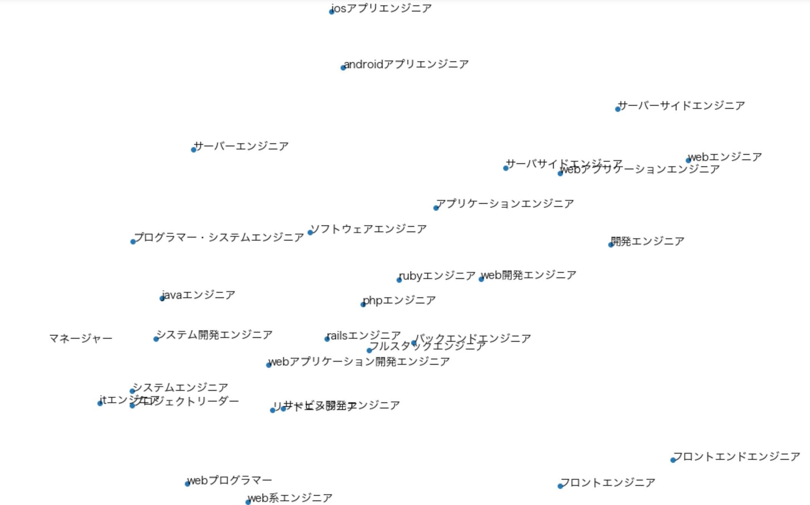

# Job word embeddings
This project builds word embeddings from job postings using [Gensim's word2vec API](https://radimrehurek.com/gensim/models/word2vec.html).  
The goal of this project is to experiment word2vec with job postings as well as applying the trained model in demo application.

## Index
* [Setup environment](./setup.md)
* [Jupyter notebook](#jupyter_notebook)
* [Experiment results](#experiment_results)
* [Demo: Semantic job search](#semantic_job_search)

## Jupyter Notebook
This repository contains [jupyter notebook](./Job_word_embeddings.ipynb) that explains the details of this project.

```
jupyter notebook Job_word_embeddings.ipynb
```

## Experiment results
### Similar words
You can find smilar job titles with a target job title, which will be useful when you find jobs with your current job title.

```python
word2vec_model.most_similar('Webエンジニア')
=> [('サーバーサイドエンジニア', 0.8966489434242249),
 ('webアプリケーションエンジニア', 0.8889687061309814),
 ('開発エンジニア', 0.8835119009017944),
 ('フルスタックエンジニア', 0.8723335266113281),
 ('rubyエンジニア', 0.8664447069168091),
 ('サーバサイドエンジニア', 0.8570215702056885),
 ('web開発エンジニア', 0.8520206212997437),
 ('アプリケーションエンジニア', 0.8453050255775452),
 ('バックエンドエンジニア', 0.8452906608581543),
 ('railsエンジニア', 0.8418977856636047)]
```

You can also find similar skills. this will be also useful when you find jobs which require similar skills with your skill set.

```python
word2vec_model.most_similar('Ruby')
=> [('php', 0.9285846948623657),
 ('perl', 0.8777764439582825),
 ('java', 0.8664125800132751),
 ('ruby on rails', 0.8557538986206055),
 ('python', 0.8433256149291992),
 ('elixir', 0.8411149978637695),
 ('symfony2', 0.8331097364425659),
 ('言語', 0.8303745985031128),
 ('web エンジニア', 0.8260266780853271),
 ('clojure', 0.8259769082069397)]
```

### Visualization


## Semantic job search
You can develop semantic job search using the similar words as `synonym`s in Elasticsearch.  

### Generate synonym file
First, you need to generate [sysnonym file](https://www.elastic.co/guide/en/elasticsearch/reference/master/analysis-synonym-tokenfilter.html) by running following code.

```sh
# save synonyms to synonym.txt
python train_word2vec_model.py
python generate_synonym_file.py
```

This is sample lines of the synonym file

```
...
機械学習=>機械 学習,自然 言語 処理,データ マイニング,マイニング,統計 学
データサイエンティスト=>データ サイエンティスト,データ サイエンス,データ マイニング,データ アナリスト,機械 学習
機械学習エンジニア=>機械 学習 エンジニア,エンジニア,開発 エンジニア,データ 分析 エンジニア,線形 代数,データ エンジニア
...
```
