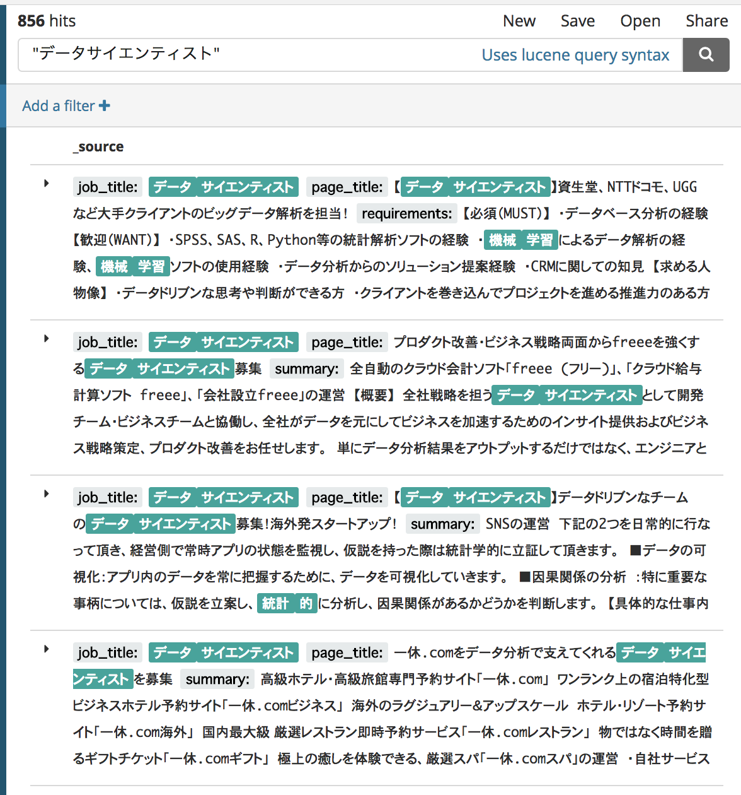

# Job word embeddings
This project builds word embeddings from job postings using [Gensim's word2vec API](https://radimrehurek.com/gensim/models/word2vec.html).  
The goal of this project is to experiment word2vec with job postings as well as applying the trained model in demo application.

## Index
* [Setup environment](./setup.md)
* [Jupyter notebook](#jupyter_notebook)
* [Experiment results](#experiment_results)
* [Demo: Semantic job search](#semantic_job_search)

## Jupyter Notebook
This repository contains [jupyter notebook](./Job_word_embeddings.ipynb) that explains the details of this project.

```
jupyter notebook Job_word_embeddings.ipynb
```

## Experiment results
### Similar words
You can find smilar job titles with a target job title, which will be useful when you find jobs with your current job title.

```python
word2vec_model.most_similar('Webエンジニア')
=> [('サーバーサイドエンジニア', 0.8966489434242249),
 ('webアプリケーションエンジニア', 0.8889687061309814),
 ('開発エンジニア', 0.8835119009017944),
 ('フルスタックエンジニア', 0.8723335266113281),
 ('rubyエンジニア', 0.8664447069168091),
 ('サーバサイドエンジニア', 0.8570215702056885),
 ('web開発エンジニア', 0.8520206212997437),
 ('アプリケーションエンジニア', 0.8453050255775452),
 ('バックエンドエンジニア', 0.8452906608581543),
 ('railsエンジニア', 0.8418977856636047)]
```

You can also find similar skills. this will be also useful when you find jobs which require similar skills with your skill set.

```python
word2vec_model.most_similar('Ruby')
=> [('php', 0.9285846948623657),
 ('perl', 0.8777764439582825),
 ('java', 0.8664125800132751),
 ('ruby on rails', 0.8557538986206055),
 ('python', 0.8433256149291992),
 ('elixir', 0.8411149978637695),
 ('symfony2', 0.8331097364425659),
 ('言語', 0.8303745985031128),
 ('web エンジニア', 0.8260266780853271),
 ('clojure', 0.8259769082069397)]
```

You can also give multiple skills to the trined model. those skills can be your current skill set.  
And then you will get similar job titles and skills with yourself.

```python
postive_skills = ['webエンジニア', 'ruby', 'redis', 'postgresql', '機械学習', 'deep learning', 'html', 'css', 'javascript']
word2vec_model.most_similar(positive=postive_skills)

=> [('webフロントエンドエンジニア', 0.8989949226379395),
  ('elixir', 0.8973215222358704),
  ('ll言語', 0.8954563736915588),
  ('web・アプリエンジニア', 0.8946321606636047),
  ('script', 0.894004225730896),
  ('web エンジニア', 0.893429696559906),
  ('phoenix', 0.8932678699493408),
  ('プロダクト開発エンジニア', 0.8929529190063477),
  ('スクレイピング', 0.8926692008972168),
  ('webサービス開発エンジニア', 0.8926246166229248)]
```

You can spacify negative skills. And you will get job titles and skills which may be intesteding to you.

```python
postive_skills = ['webエンジニア', 'ruby', 'redis', 'postgresql', '機械学習', 'deep learning']
negative_skills = ['html', 'css', 'javascript']
word2vec_model.most_similar(positive=postive_skills, negative=negative_skills)

=> [('数理モデル', 0.7106159329414368),
  ('chainer', 0.6900843381881714),
  ('lucene', 0.689948320388794),
  ('音声合成', 0.6863459348678589),
  ('hbase', 0.6846038699150085),
  ('python', 0.6761983036994934),
  ('hive', 0.6735614538192749),
  ('データセット', 0.6731375455856323),
  ('分散データベース', 0.6727677583694458),
  ('erlang', 0.6702989935874939)]
```

### Visualization


## Semantic job search
You can develop semantic job search using the similar words as `synonym`s in Elasticsearch.  

### Generate synonym file
First, you need to generate [sysnonym file](https://www.elastic.co/guide/en/elasticsearch/reference/master/analysis-synonym-tokenfilter.html) by running following code.

```sh
# save synonyms to synonym.txt
python train_word2vec_model.py
python generate_synonym_file.py
```

This is sample lines of the synonym file

```
...
機械学習=>機械 学習,自然 言語 処理,データ マイニング,マイニング,統計 学
データサイエンティスト=>データ サイエンティスト,データ サイエンス,データ マイニング,データ アナリスト,機械 学習
機械学習エンジニア=>機械 学習 エンジニア,エンジニア,開発 エンジニア,データ 分析 エンジニア,線形 代数,データ エンジニア
...
```

### Create Elasticsearch index
You need to create ES index and set custom mapping to use [synonym token filter](https://www.elastic.co/guide/en/elasticsearch/reference/master/analysis-synonym-tokenfilter.html) at query timing.

For demonstration, I prepared 2 mappings. One is for normal search and the other is for semantic search. (these mappings are valid for elasticsearch v6.2.2).

```sh
# apply normal search mapping to the index "job_postings"
curl -XPUT -H "Content-Type: application/json" \
  localhost:9200/job_postings -d @jp_mapping.json

# apply semantic search mapping to the index "job_postings_semantic"
curl -XPUT -H "Content-Type: application/json" \
  localhost:9200/job_postings_semantic -d @jp_semantic_mapping.json
```

### Insert job postings
```python
# insert job postings to the normal serarch index
python insert_jobs_to_es.py job_postings

# insert job postings to the semantic serarch index
python insert_jobs_to_es.py job_postings_semantic
```

### Result
Let's compare the results of those 2 settings.

|Normal Search|Semantic|
|---|---|
|||

As you can see, you get more results from the semantic search because it finds job postings that contain similar words, such as `機械学習`, `統計的` for `データサイエンティスト` in the above example.
